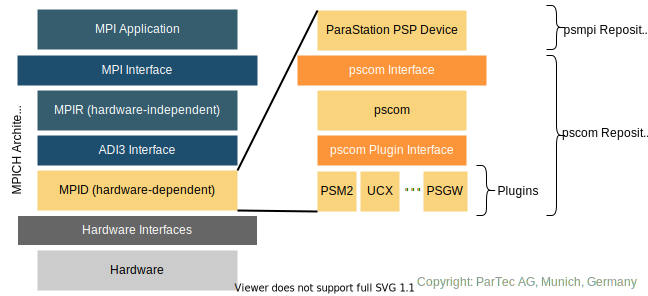

# ParaStation MPI
[TOC]

## Introduction
ParaStation MPI is an implementation of the Message-Passing Interface (MPI)
Standard. Being an [MPICH](https://www.mpich.org)-derivate it bases on the MPICH-4.1.1 implementation.



As shown in the figure above, ParaStation MPI relies on the low-level
communication layer [pscom](https://github.com/parastation/pscom) for the
implementation of the PSP Device on the ADI-Layer of the MPICH architecture.
ParaStation MPI provides full MPI-4 compliance including support for the MPI Sessions model.
Furthermore, the Process Management Interface for Exascale (PMIx) is supported as interface to the process manager.

## Requirements
### Mandatory
* C compiler with C99 support
* ParaStation Communication library ([pscom](https://github.com/parastation/pscom))

### Optional
* ParaStation Management ([psmgmt](https://github.com/parastation/psmgmt)) process manager if you do not want to use the Hydra process manager that comes with MPICH
* C++ compiler for applications written in C++
* Fortran compiler for applications written in Fortran
* PMIx library if you want to use PMIx as interface to the process manager (use of PMIx and Hydra is mutual exclusive)
* hcoll library for hcoll support
* hwloc library for hwloc support in MPICH/hydra
* CUDA runtime library for CUDA awareness

## Installation

### Configure ParaStation MPI
Download the source code from GitHub:
```console
$ git clone https://github.com/ParaStation/psmpi.git psmpi
```

Run Autotools:
```console
$ cd /path/to/psmpi
$ ./autogen.sh
```

We encourage you *not* to build ParaStation MPI directly within the main source
folder:
```console
$ mkdir build && cd build
```

ParaStation MPI relies on Autotools as the build system requiring a configure
step. The build system already provides so-called "confsets" that pass the
necessary configuration arguments for a particular installation type to the
underlying MPICH build system. It is strongly recommended to rely on these
confsets for a proper installation! Currently, the following confsets are
provided:
```properties
default    : Like 'gcc'
none       : Do not configure mpich. Prepare only for tar, rpm and srpm build

gcc        : Use Gnu compiler (gcc)
intel      : Use Intel compiler (icx)
icx        : Like 'intel'
pgi        : Portland group compiler (pgcc)
nvhpc      : Nvidia HPC compiler (nvc)
llvm       : llvm-based toolchains (e.g., AOCC)

devel      : With error checking and debug info (gcc)
debug      : Like 'devel' but without any optimizations

user       : No predefined options
ch3        : original mpich ch3 device (no parastation)
ch4        : original mpich ch4 device (no parastation)
```

The following example configures ParaStation MPI for using the gcc compiler:
```console
$ ../configure --prefix=/path/to/installation/dir --with-confset=default
```

We recommend developers to use the `devel` confset for more error checking and debug infos at compile time.

#### Optional configure arguments
| Argument                    | Default  | Description                                                      |
------------------------------|----------|------------------------------------------------------------------|
| `--with-pscom[=path]`       | yes      |Use pscom as communication transport [path to pscom installation] |
| `--with-cuda[=path]`        | no       |Use CUDA awareness [path to CUDA installation]                    |
| `--with-hydra`              | no       |Build and install MPICH's process manager Hydra                   |
| `--with-hcoll[=path]`       | no       |Use hcoll support [path to hcoll installation]                    |
| `--with-hwloc[=path]`       | no       |Use hwloc in MPICH/Hydra [built-in or path to hwloc installation] |
| `--with-pmix[=path]`        | no       |Use PMIx as process manager interface [path to PMIx installation] |
| `--enable-threading`        | disabled |Enable multi-thread support                                       |
| `--enable-msa-awareness`    | disabled |Enable MSA awareness like hierarchical collectives                |
| `--enable-statistics`       | disabled |Enable the collection of statistical information                  |
| `--enable-confset-overwrite`| disabled |Enable overwriting of compilers selected by confset via environment variables `CC`, `CXX` and `FC` |

### Build ParaStation MPI
For a successful build, you have to provide a path to your pscom installation via the
`--with-pcom[=path]` configure option (defaults to `/opt/parastation`) or alternatively by setting
the `LIBRARY_PATH` and `CPATH` environment variables:
```console
$ export LIBRARY_PATH=/path/to/pscom/installation/lib[64]:${LIBRARY_PATH}
$ export CPATH=/path/to/pscom/installation/include:${CPATH}
```

Now, ParaStation MPI can be built and installed in accordance with the
configuration arguments:
```console
$ make -j8 && make install
```

### Prepare the environment
To use ParaStation MPI for building and running MPI applications, it is
advisable to adjust the environment properly. This can be done, e.g.,  by using
the following bash script:
```bash
#!/bin/bash

if [ $# -eq 0 ]; then
    echo "ERROR: Please provide the path to ParaStation MPI. Abort!"
    exit -1
fi

PARASTATION_MPI=`realpath ${1}`

export PATH="${PARASTATION_MPI}/bin${PATH:+:}${PATH}"
export CPATH="${PARASTATION_MPI}/include${CPATH:+:}${CPATH}"
export LD_LIBRARY_PATH="${PARASTATION_MPI}/lib${LD_LIBRARY_PATH:+:}${LD_LIBRARY_PATH}"
export LIBRARY_PATH="${PARASTATION_MPI}/lib${LIBRARY_PATH:+:}${LIBRARY_PATH}"
```

## Alternative Installation

Instead of relying on the pscom as a shared-library, ParaStation MPI can be
optionally compiled as a single shared-object by directly using the pscom
sources. For doing so, the pscom source files are required:
```console
$ git clone https://github.com/ParaStation/pscom.git pscom
```

After downloading the psmpi sources, the same
configuration parameters apply as discussed above (see [Configure](#configure-parastation-mpi)).
Additionally, you will need to add the `--with-pscom-allin` flag, e.g.:
```console
$ ../configure --prefix=/path/to/installation/dir --with-confset=default --with-pscom-allin=/path/to/pscom/sources
```

By default, the pscom4ucp as well as the pscom4psm plugins are included
firmly into ParaStation MPI if `--with-pscom-allin` is set and the related
low-level drivers are found. For specifying the plugins to be built-in
explicitly, the `--with-pscom-builtin[=list]` option can be used.


## Runtime Parameters

### Debugging

| Environment Variable         | Description                                                                                 |
-------------------------------|---------------------------------------------------------------------------------------------|
| `PSP_DEBUG=0`                | only fatal conditions (like detected bugs)                                                  |
| `PSP_DEBUG=1`                | fatal conditions + errors (default)                                                         |
| `PSP_DEBUG=2`                |  + warnings                                                                                 |
| `PSP_DEBUG=3`                |  + information                                                                              |
| `PSP_DEBUG=4`                |  + debug                                                                                    |
| `PSP_DEBUG=5`                |  + verbose debug                                                                            |
| `PSP_DEBUG=6`                |  + tracing calls                                                                            |
| `PSP_DEBUG_VERSION=1`        | Show always the pscom version (info)                                                        |
| `PSP_DEBUG_CONTYPE=1`        | Show connection types (info)                                                                |
| `PSP_HARD_ABORT=0`           | Process termination in MPI_Abort() via exit() (default)                                     |
| `PSP_HARD_ABORT=1`           | Process termination in MPI_Abort() via PMI_Abort()                                          |
| `PSP_HARD_ABORT=2`           | Process termination in MPI_Abort() via _exit()                                              |
| `PSP_HARD_ABORT=3`           | Process termination in MPI_Abort() via abort()                                              |
| `PSP_CUDA_ENFORCE_STAGING=1` | Enforce staging of CUDA buffers via host memory (with a _significant_ performance penalty!) |

### Feature Activation

| Environment Variable        | Description                                          | Required [build config options](#optional-configure-arguments) |
------------------------------|------------------------------------------------------|------------------------------|
| `PSP_CUDA=1`                | Enable/Disable CUDA awareness (default = 0)          | `--with-cuda`                |
| `PSP_HCOLL=1`               | Enable/Disable HCOLL support (default = 0)           | `--with-hcoll[=path]`        |
| `PSP_SMP_AWARENESS=1`       | Take locality information into account (default = 1) |                              |
| `PSP_SMP_AWARE_COLLOPS=1`   | Enable/Disable SMP-aware collectives (default = 0)   | `--enable-msa-awareness`      |
| `PSP_MSA_AWARENESS=1`       | Take topology information into account (default = 0) | `--enable-msa-awareness`      |
| `PSP_MSA_AWARE_COLLOPS=1`   | Enable/Disable MSA-aware collectives (default = 0)   | `--enable-msa-awareness`       |


### Statistical Analysis

| Environment Variable        | Description                                          | Required [build config options](#optional-configure-arguments) |
------------------------------|------------------------------------------------------|------------------------------|
| `PSP_HISTOGRAM=1`           | Enable the collection of statistical data            | `--enable-statistics` |
| `PSP_HISTOGRAM_MIN=x`       | Set the lower message size limit for the histogram   | `--enable-statistics` |
| `PSP_HISTOGRAM_MAX=y`       | Set the upper message size limit for the histogram   | `--enable-statistics` |
| `PSP_HISTOGRAM_SHIFT=z`     | Bit shift for the number of bins of the histogram    | `--enable-statistics` |
| `PSP_HISTOGRAM_CONTYPE=con` | Limit the histogram to a particular connection type  | `--enable-statistics` |
| `PSP_HCOLL_STATS=1`         | Enable the collection of HCOLL usage statistics      | `--enable-statistics  --with-hcoll[=path]`|

## Test Suite

MPICH has a test suite that can also be used and is even extended by ParaStation MPI.
````console
$ make test
````
...will run the complete test suite comprising tests in the following subfolders in `mpich2/test/mpi/`:

```
parastation
cuda
attr
ckpoint
coll
comm
cxx
datatype
errhan
errors
f08
f77
f90
ft
group
impls
info
io
init
mpi_t
perf
pt2pt
rma
spawn
threads
topo
part
session
```

### Selecting Test Directories and Test Sets

However, you can also have only tests of a certain subdirectory to be executed by specifying a `TESTDIR`, for example:
```console
$ make test TESTDIR=pt2pt
```

In addition, a `TESTSET` can be specified to further restrict the number of tests.
The tests that belong to a certain test set are stated as a list in a file with the same name within the above listed subdirectories.
Currently, only `ps-test-minimal` (minimal list of tests) and `testlist` (containing all tests) are valid test sets.
So, for example, the following invocation runs all tests belonging to `ps-test-minimal` within all subdirectories:

```console
$ make test TESTSET=ps-test-minimal
```
And if, for example, the test set `ps-test-minimal` should only be executed for tests within the subfolder `pt2pt`, then the following invocation is the means of choice:
```console
$ make test TESTSET=ps-test-minimal TESTDIR=pt2pt
```

In the case that several directories and/or several test sets should be used for a run, one can do this by using comma-separated lists and the variables `TESTDIRS` and `TESTSETS`.
(Please note the additional "S" at the end of the variable names!)
However, in this case no explicit check for validity of the passed test sets or folder names is performed.
Example:
```console
$ make test TESTDIRS=pt2pt,coll,info
```

Furthermore, there is a "meta" set of tests that are specifically intended for large numbers of processes and/or large messages and data sets.
This additional (and somehow orthogonal) set can be chosen via `largetest` as the
`make` target:
```console
$ make largetest
```
...which can also be used in combination with the `TESTSET`/`TESTSETS` and the `TESTDIR`/`TESTDIRS` options.

### Using Test Configurations

When running the tests, some settings like the `mpiexec` command to be used are pre-configured and depend on the configuration chosen for psmpi during its top-level configure call.
However, there is still the possibility to overwrite some of such configurations by explicitly setting the following environment variables:

* `MPIEXEC`: choose the path and the executable to be used for process start
* `MPIEXECARG`: additional arguments to be passed to the `mpiexec` command

For example:
```
$ make test MPIEXEC=/opt/parastation/bin/mpiexec MPIEXECARG="-e MPIEXEC_UNIVERSE_SIZE=128"
```

Furthermore, there is a small set of such overriding configurations that can also be chosen via the `TESTCONF` option.
The following configurations are available:

* `hydra`: Force the use of MPICH's Hydra `mpiexec`
* `psmgmt`: Force the use of psmgmt's `mpiexec` in `/opt/parastation/bin`
* `verbose`: Switch on verbose mode for `runtests` script
* `psmgmt/memcheck`: Call psmgmt's `mpiexec` with `--memcheck`
* `psmgmt/valgrind`: Call psmgmt's `mpiexec` with `--valgrind`
* `psmgmt/pmix`: Call psmgmt's `mpiexec` with `--pmix`

If multiple of such configurations are to be selected at the same time, then the `TESTCONFS` (mind the additional `S` at the end!) can be used.
Example:
```
$ make test TESTCONFS=hydra,verbose
```

## Contributing
To ensure that all commits conform to the coding style, the pre-commit hook should be activated. Therefore, you have to link this from the top-level source directory:
```console
$ ln -s ../../scripts/hooks/pre-commit .git/hooks/pre-commit
