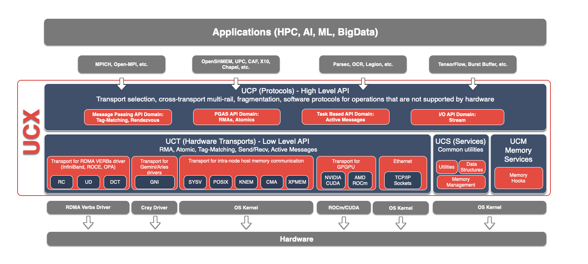

<div align="center">
  <a href="http://www.openucx.org/"></a>
  <br>
  <a href="https://twitter.com/intent/follow?screen_name=openucx"> </a>
  <a href="https://openucx.github.io/ucx/api/latest/html/"></a>
  <a href='https://openucx.readthedocs.io/en/master/?badge=master'>
  <a href="https://github.com/openucx/ucx/releases/latest"></a>
</div>

<hr>

# Unified Communication X

Unified Communication X (UCX) is an
[award winning](https://losalamosreporter.com/2019/11/07/nine-los-alamos-national-laboratory-projects-win-rd-100-awards),
optimized production proven-communication framework for modern, high-bandwidth
and low-latency networks.

UCX exposes a set of abstract communication primitives that utilize the best of
available hardware resources and offloads. These include RDMA (InfiniBand and RoCE),
TCP, GPUs, shared memory, and network atomic operations.

Please visit our [documentation site](https://openucx.readthedocs.io/en/master)
 for more details.

<hr>

<!-- TOC generated by https://github.com/ekalinin/github-markdown-toc -->

* [Using UCX](#using-ucx)
* [Known issues](#known-issues)
* [Architecture](#architecture)
* [Supported Transports](#supported-transports)
* [Supported CPU Architectures](#supported-cpu-architectures)
* [Licenses](#licenses)
* [Our Community](#our-community)
* [Contributor Agreement and Guidelines](#contributor-agreement-and-guidelines)
* [Publications](#publications)


<hr>

## Using UCX

### Release Builds

Building UCX is typically a combination of running "configure" and "make".
Execute the following commands to install the UCX system from within the
directory at the top of the tree:

```sh
$ ./autogen.sh
$ ./contrib/configure-release --prefix=/where/to/install
$ make -j8
$ make install
```

NOTE: Compiling support for various networks or other specific hardware may
require additional command line flags when running configure.

### Developer Builds

```bash
$ ./autogen.sh
$ ./contrib/configure-devel --prefix=$PWD/install-debug
```

*** NOTE: Developer builds of UCX typically include a large performance
penalty at run-time because of extra debugging code.

### Build RPM package
```bash
$ contrib/buildrpm.sh -s -b
```

### Build DEB package
```bash
$ dpkg-buildpackage -us -uc
```

### Build Doxygen documentation
```bash
$ make docs
```

### OpenMPI and OpenSHMEM installation with UCX
[Wiki page](http://github.com/openucx/ucx/wiki/OpenMPI-and-OpenSHMEM-installation-with-UCX)

### MPICH installation with UCX
[Wiki page](http://github.com/openucx/ucx/wiki/MPICH-installation-with-UCX)

### UCX Performance Test

Start server:

```sh
$ ./src/tools/perf/ucx_perftest -c 0
```
Connect client:

```sh
$ ./src/tools/perf/ucx_perftest <server-hostname> -t tag_lat -c 1
```
> NOTE the `-c` flag sets CPU affinity. If running both >commands on same host, make sure you set the affinity to different CPU cores.


### Running internal unit tests

```sh
$ make -C test/gtest test
```

<hr>


## Known issues
* UCX version 1.8.0 has a bug that may cause data corruption when TCP transport
  is used in conjunction with shared memory transport. It is advised to upgrade
  to UCX version 1.9.0 and above. UCX versions released before 1.8.0 don't have
  this bug.

* UCX may hang with glibc versions 2.25-2.29 due to known bugs in the
  pthread_rwlock functions. When such hangs occur, one of the UCX threads gets
  stuck in pthread_rwlock_rdlock (which is called by ucs_rcache_get), even
  though no other thread holds the lock. A related issue is reported in
  [glibc Bug 23844](https://sourceware.org/bugzilla/show_bug.cgi?id=23844).
  If this issue occurs, it is advised to use glibc version provided with your
  OS distribution or build glibc from source using versions less than 2.25 or
  greater than 2.29.

<hr>


## Architecture



| Component | Role        | Description |
| :---:     | :---:       | ---         |
| UCP | Protocol          | Implements high-level abstractions such as tag-matching, streams, connection negotiation and establishment, multi-rail, and handling different memory types |
| UCT | Transport         | Implements low-level communication primitives such as active messages, remote memory access, and atomic operations |
| UCS | Services          | A collection of data structures, algorithms, and system utilities for common use |
| UCM | Memory            | Intercepts memory allocation and release events, used by the  memory registration cache |

<hr>

## Supported Transports

* [Infiniband](https://www.infinibandta.org/)
* [Omni-Path](https://www.intel.com/content/www/us/en/high-performance-computing-fabrics/omni-path-driving-exascale-computing.html)
* [RoCE](http://www.roceinitiative.org/)
* [Cray Gemini and Aries](https://www.cray.com/)
* [CUDA](https://developer.nvidia.com/cuda-zone)
* [ROCm](https://rocm.github.io/)
* Shared Memory
    * posix, sysv, [cma](https://dl.acm.org/citation.cfm?id=2616532), [knem](http://knem.gforge.inria.fr/), and [xpmem](https://github.com/hjelmn/xpmem)
* TCP/IP

<hr>

## Supported CPU Architectures

* [x86_64](https://en.wikipedia.org/wiki/X86-64)
* [Power8/9](https://www.ibm.com/support/knowledgecenter/en/POWER9/p9hdx/POWER9welcome.htm)
* [Arm v8](https://www.arm.com/products/silicon-ip-cpu)

<hr>

## Licenses

UCX is licensed as:

* [BSD3](LICENSE)

<hr>

## Our Community

* [Project Website](http://www.openucx.org/)
* [ReadTheDocs](https://openucx.readthedocs.io/en/master/)
* [Github](http://www.github.com/openucx/ucx/)
* [Software Releases](http://www.github.com/openucx/ucx/releases)
* [Mailing List](https://elist.ornl.gov/mailman/listinfo/ucx-group)
* [Twitter](https://twitter.com/openucx)

<hr>

## Contributor Agreement and Guidelines

In order to contribute to UCX, please sign up with an appropriate
[Contributor Agreement](http://www.openucx.org/license/).

Follow these
[instructions](https://github.com/openucx/ucx/wiki/Guidance-for-contributors)
when submitting contributions and changes.

## Publications

To reference UCX in a publication, please use the following entry:

```bibtex
@inproceedings{shamis2015ucx,
  title={UCX: an open source framework for HPC network APIs and beyond},
  author={Shamis, Pavel and Venkata, Manjunath Gorentla and Lopez, M Graham and Baker, Matthew B and Hernandez, Oscar and Itigin, Yossi and Dubman, Mike and Shainer, Gilad and Graham, Richard L and Liss, Liran and others},
  booktitle={2015 IEEE 23rd Annual Symposium on High-Performance Interconnects},
  pages={40--43},
  year={2015},
  organization={IEEE}
}
```

To reference the UCX website:

```bibtex
@misc{openucx-website,
    title = {{The Unified Communication X Library}},
    key = {{{The Unified Communication X Library}},
    howpublished = {{\url{http://www.openucx.org}}}
}
```
